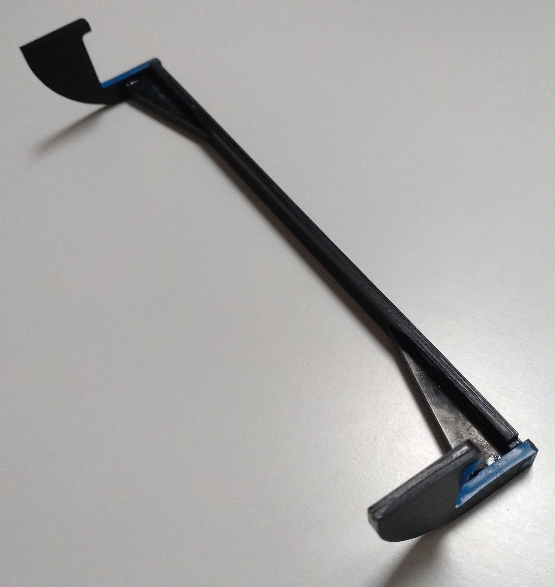
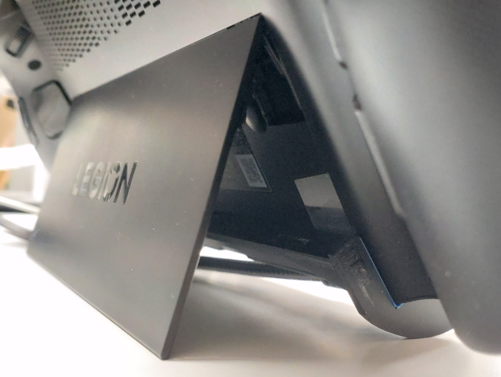

# legion-go-stand
DXF files for a Lenovo Legion Go stand where the lower USB cable still can connect

# what
A diy stand (wooden) for Lenovo Legion Go (black) with USB-C cable (blue) attached to lower port.

## the stand

## 3d view

## side view

## front view

# why
I use my Lenovo Legion Go with two USB-C cables (one for power/hub, one for external graphics card) but this allows me to only lay it flat.
With attached controllers, this is no issue but detaching them would put it to the table with no airflow possible.

My little stand allows you to still have the Legion Go in standing position for good airflow in any angle, use the lower USB-C port with a 90° cable and detach the controllers.
What more could you possible want?

# how
Get the three files from the [dxf subfolder](dxf), cut/laser/'make' them from 3mm thick material and glue them together.
Parts A and B are required twice, C once.

Feel free to use/modify/share according to [the license](LICENSE).
